# Intro to Big O
* [BIG O SLIDES](https://cs.slides.com/colt_steele/big-o-notation)

#### **OBJECTIVES**
- Motivate the need for something like Big O Notation
- Describe what Big O Notation is
- Simplify Big O Expressions
- Define "time complexity" and "space complexity"
- Evaluate the time complexity and space complexity of different algorithms using Big O Notation
- Describe what a logarithm is

#### **IDEA**
- Imagine we have multiple implementations of the same function
- How can we determine which one is the best?
- How to classify and talk about code
- It's important to have a precise vocabulary to talk about how our code performs
- Useful for discussing trade-offs between different approaches
- When your code slows down or crashes, identifying parts of the code that are inefficient can help us find pain points in our applications 
- LESS IMPORTANT: It comes up in interviews

## Timing Our Code
#### **EXAMPLE**
1. Suppose we want to write a function that calculates the sum of all numbers from 1 up to (and including) some number *n*.
```js
//FIRST TO COME TO MIND
  function addUpTo(n) {
    let total = 0;
    for (let i = 1; i <= n; i++) {
      total += i;
    }
    return total;
  }

  //ANOTHER OPTION --> No Loop Involved
  function addUpTo(n) {
    return n * (n + 1) / 2;
  }
  //WHICH ONE IS BETTER?????
```
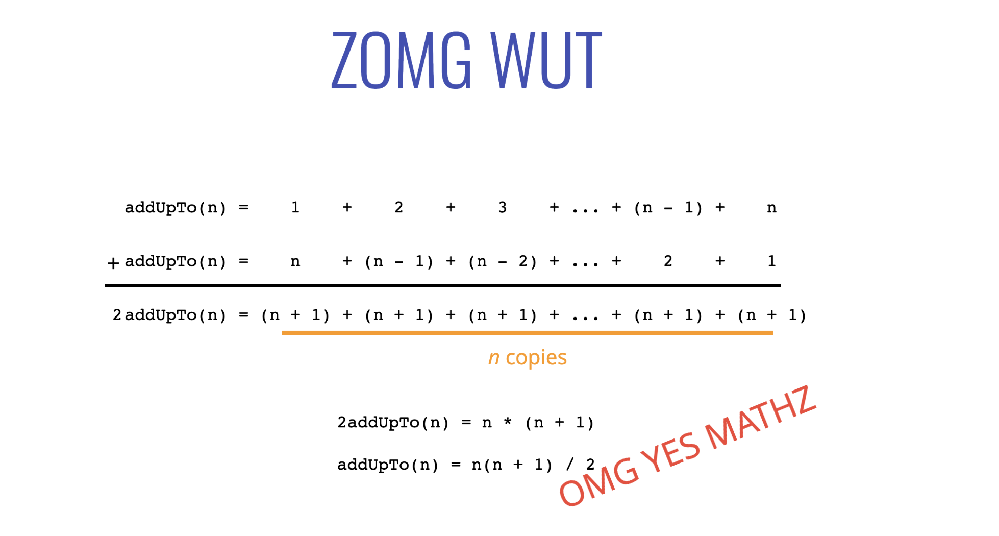

#### WHAT DOES BETTER MEAN?
- Faster? --> Focus here first
- Less memory-intensive?
- More readable?
- Brevity?

#### Evaluating Speed
- Built in Timing Functions - method: `performance.now()`
```js
//going to tell the number of milliseconds since the document was crated (since the window was opened) --> save to variable before calling function 
  let t1 = performance.now();
  addUpTo(1000000000);
  //after that finishes check performance --> should have incremented a bunch of of milliseconds 
  let t2 = performance.now();
  //Have two numbers --> subtract and divide by 1000
  console.log(`Time Elapsed: ${(t2 - t1) / 1000} seconds.`)
```
* For Node.JS --> built in `perf-hooks`
```js
const { PerformanceObserver, performance } = require('perf_hooks');
```
#### * When we run first option every time we run the code the Time Elapsed changes slightly
- 1st run: Time Elapsed: 1.1416461179852486 seconds.
- 2nd run: Time Elapsed: 1.2111540130078793 seconds.
- 3rd run: Time Elapsed: 1.188018821001053 seconds.

#### * When we run second option --> much smaller number
- 1st run: Time Elapsed: 0.00046827000379562377 seconds.
- 2nd run: Time Elapsed: 0.000020511001348495484 seconds.
- 3rd run: Time Elapsed: 0.000020467013120651246 seconds.

#### The Problem with Time
- Different machines will record different times
- The same machine will record different times!
- For fast algorithms, speed measurements may not be precise enough?

## Counting Operations
- Rather than counting *seconds*, which are so variable...
- Count the *number* of simple operations the computer has to perform
- time will always be determined by the number of operations 

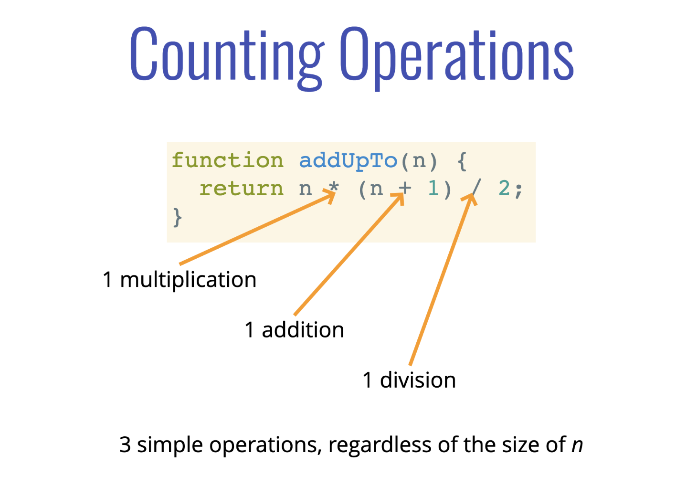
* Slower Function with Loop with be based on *n*
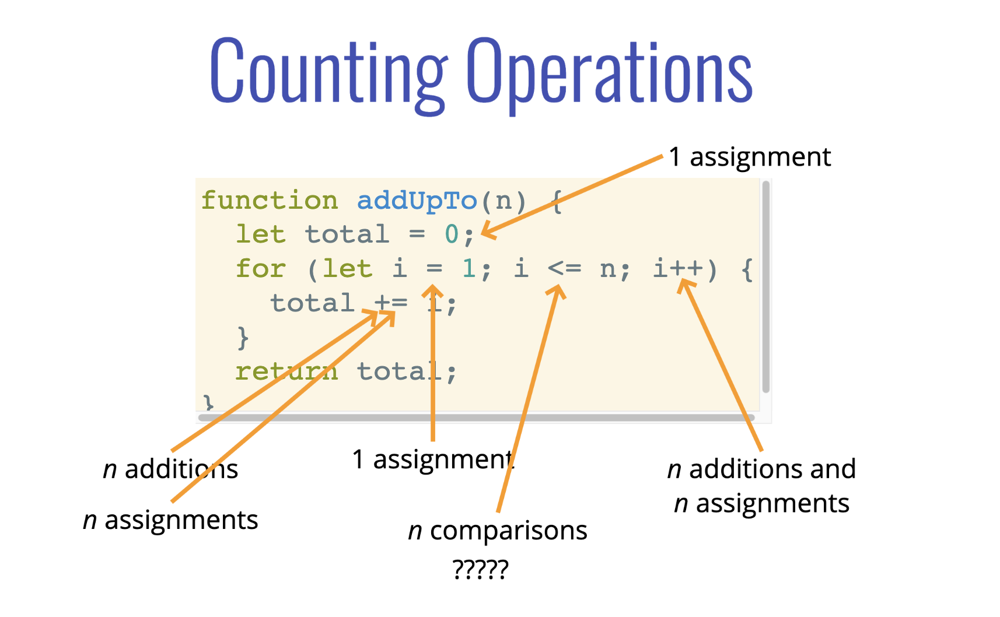
- How to we generalize this last function
* COUNTING IS HARD
- Depending on what we count, the number of operations can be as low as 2n or as high as 5n + 2
- But regardless of the exact number, the number of operations grows roughly proportionally with *n*
- If *n* doubles, the number of operations will also roughly double
- WE CARE ABOUT THE GENERAL TREND --> BIG 0

## Visualizing Time Complexities
* [Performance Tracker](https://rithmschool.github.io/function-timer-demo/)
- Blue line is slower function --> grey is faster function
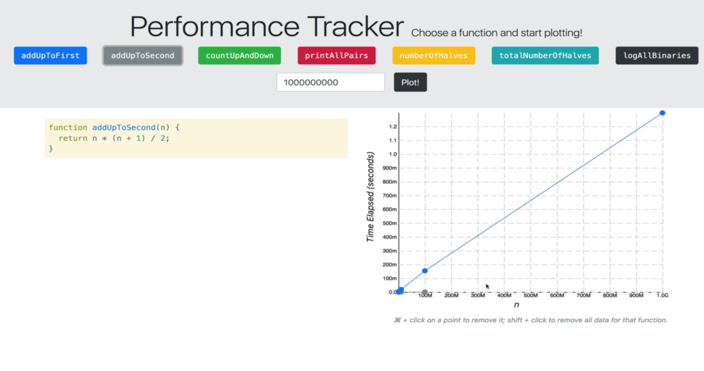

## Official Intro to Big O
- Big O Notation is a way to formalize fuzzy counting
- It allows for us to talk formally about how the runtime of an algorithm grows as the input grows
- Watch the trends

#### **BIG O DEFINITIONS**
- We say that an algorithm is **O(f(n))** if the number of simple operations the computer has to do is eventually less than a constant times **f(n)**, as **n** increases
* f(n) could be linear (f(n) = n) (i.e. input: f(n) vs runtime: n)
* f(n) could be quadratic (f(n) = n²)
* f(n) could be constant (f(n) = 1)
* f(n) could be something entirely different

#### **EXAMPLE**

```js
function addUpTo(n) {
  return n * (n + 1) / 2;
}
// Always 3 Operations ==> Big O of 1 ==> O(1)
//As n changed not reflected in the runtime

function addUpTo(n) {
  let total = 0;
  for (let i = 1; i <= n; i++) {
    total += i;
  }
  return total;
}
//Number of operations is (eventually) bounded by a multiple of n (say, 10n) ==> O(n)
//runtime grows basically in a one to one ratio
```
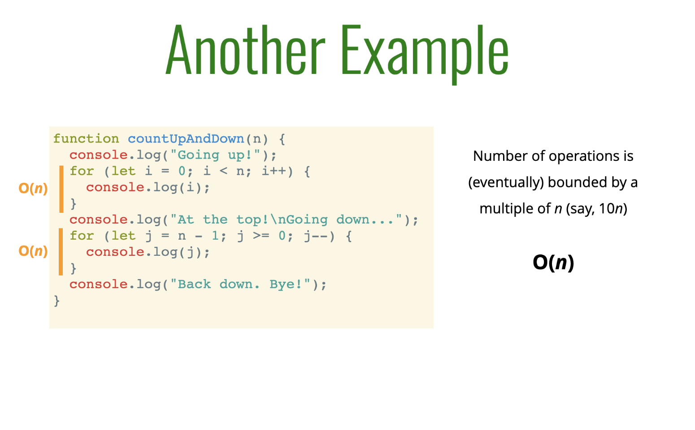
- Only care about bigger picture so we simplify it down to O(n) even though there are two loops
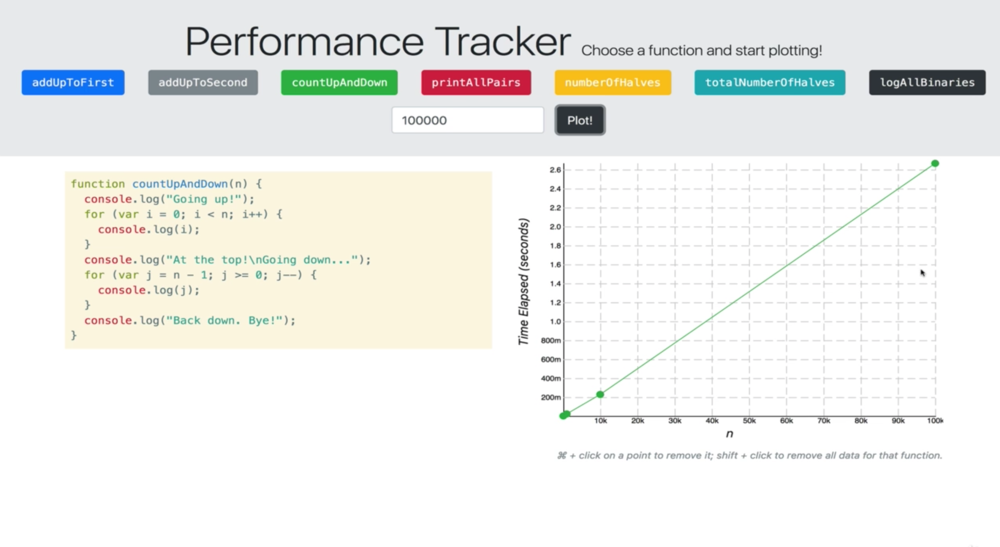

#### **Nested Loop ==> OMG MOAR EXAMPLEZ**
```js
  function printAllPairs(n) {
    for (let i = 0; i < n; i++) {
      for (let j = 0; j < n; j++) {
        console.log(i, j);
      }
    }
  }
```
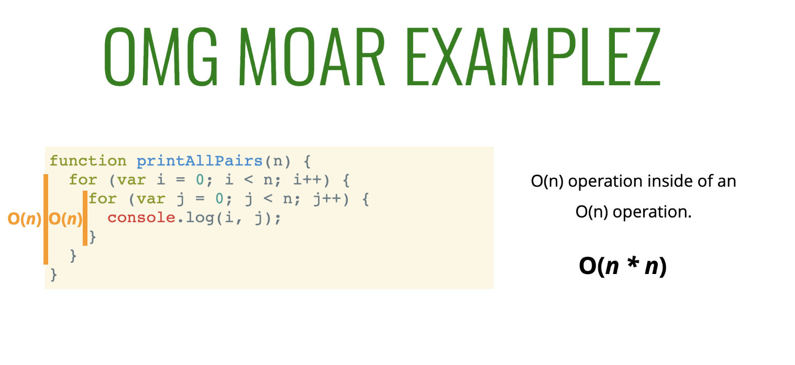
* O(n * n) ==> O(n²)
- as n grows the runtime roughly grows at the rate of n squared
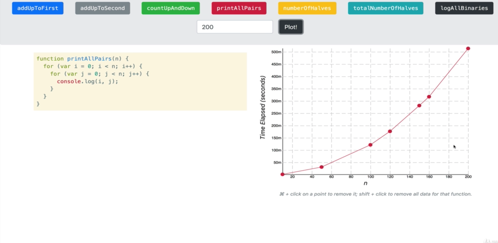
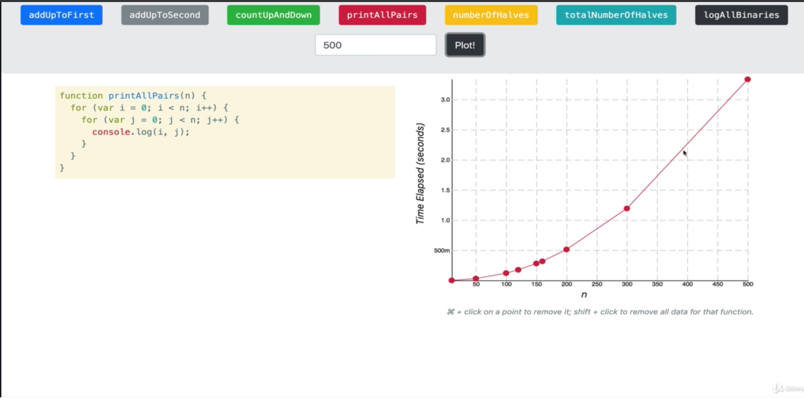

## Simplifying Big O Expressions
- When determining the time complexity of an algorithm, there are some helpful rules of thumb for big O expressions
- These rules of thumb are consequences of the definition of big O notation
- based of general FUZZY trends
#### CONSTANTS DON'T MATTER 
1. O(2n) ==> O(n)
2. O(500) ==> O(1)
3. O(13n²) ==> O(n²)
#### SMALLER TERMS DON'T MATTER
1. O(n + 10) ==> O(n)
2. O(100n + 50) ==> O(n)
3. O(n² + 5n + 8) ==> O(n²)

#### **BIG O SHORTHANDS**
- Analyzing complexity with big O can get complicated
- There are several rules of thumb that can help
- These rules won't **ALWAYS** work, but are a helpful starting point
1. Arithmetic operations are constant
2. Variable assignment is constant
3. Accessing elements in an array (by index) or object(by key) is constant
4. In an loop, the complexity is the length of the loop times the complexity of whatever happens inside the loop

#### **Examples**
```js
//Prints Min of 5 numbers
  function logAtLeast5(n) {
    for (let i = 1; i <= Math.max(5, n); i++) {
      console.log(i);
    }
  }

  //BIG O ==> O(n) --> as n grows the number of operations grow
```
```js
//This will log whatever number is smaller
//will only take positive numbers, and 0 does nothing
  function logAtMost5(n) {
    for( let i = 1; i <= Math.min(5, n); i++) {
      console.log(i);
    }
  }

  //BIG O ==> as n grows the Big O is constant ==> O(1);
```
#### CHART OF BIG O NOTATION
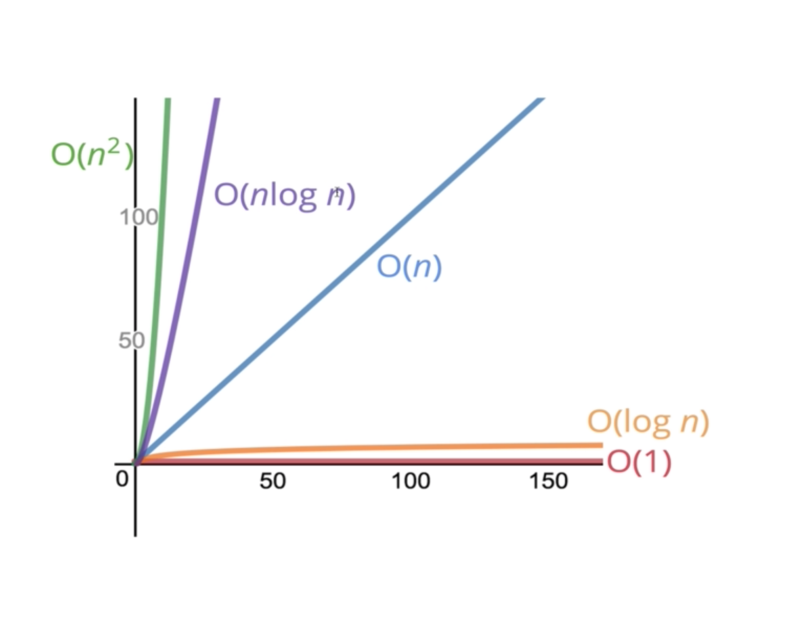

* QUIZ ANSWER I GOT WRONG:
1. Simplify `O(n^2 + n^3)` = `O(n^3)`

## Space Complexity
- So far, we've been focusing on **time complexity**: how can we analyze the *runtime* of an algorithm as the size of the inputs increase?
- We can also use big O notation to analyze **space complexity**: how much additional memory do we need to allocate in order to run the code in our algorithm?
* What about the inputs?
- Sometimes you'll hear the term **auxiliary space complexity** to refer to space required by the algorithm, not including space taken up by the inputs.
- Unless otherwise noted, when we talk about space complexity, technically we'll be talking about auxiliary space complexity.

#### **Space Complexity in JS** ==> Rules of Thumb
- Most primitives (booleans, numbers, undefined, null) are constant space
- Strings require O(n) space (where *n* is the string length)
- Reference types are generally O(n), where *n* is the length (for arrays) or the number of keys (for objects)
1. **Example**
```js
//Function takes array and sums all items in array
  function sum(arr) {
    let total = 0;
    for (let i = 0; i < arr.length; i++) {
      total += arr[i];
    }
    return total;
  }
  //O(1) --> Constant space --> We only have these two variables adn they exist no matter what, we are not adding any variables based off of the length --> we are adding to the total variable, but not making a new variable
```
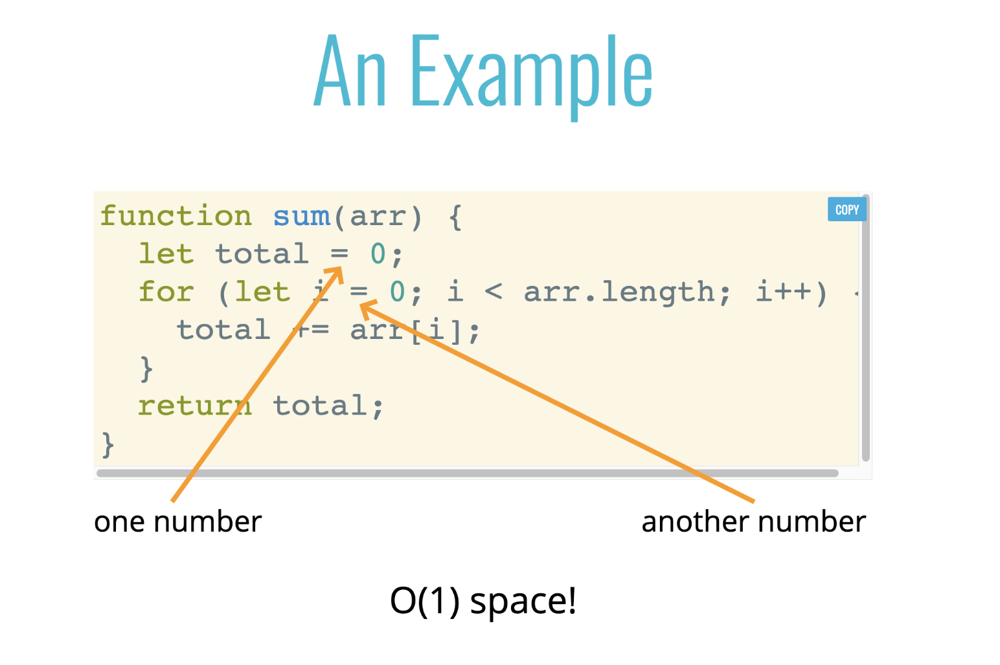

2. **EXAMPLE**
```js
  //Double Every Number in Array
  function double(arr) {
    let newArr = [];
    for (let i = 0; i < arr.length; i++) {
      newArr.push(2 * arr[i]);
    }
    return newArr;
  }
  //this is making a new array
  //starts with making that new array 
  //then loops over the length of the first array
  //then it multiplies each item and pushes it on to new array
  //then it returns new array
  //O(n) SPACE! --> array gets longer directly in proportion to the length of the input --> space that's taken up is directly proportionate to n (to the input array)  
```
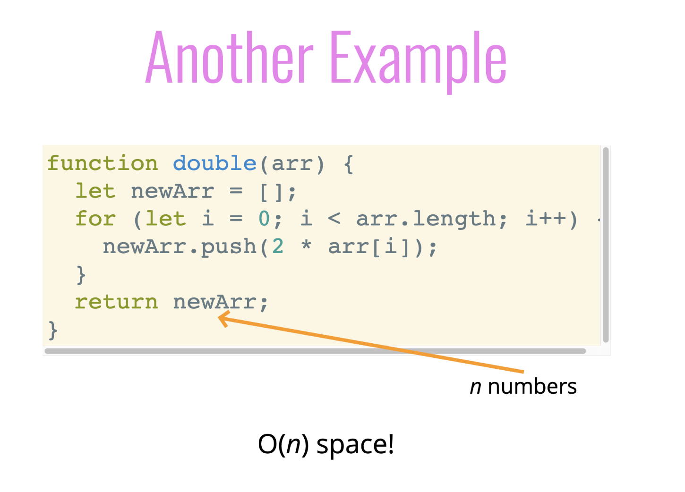

## Logs and Section Recap
#### **Logarithms**
- We've encountered some of the most common complexities: O(1), O(n), O(n^2)
- Sometimes big O expressions involve more complex mathematical expressions
- One that appears more often that you might like is the logarithm!

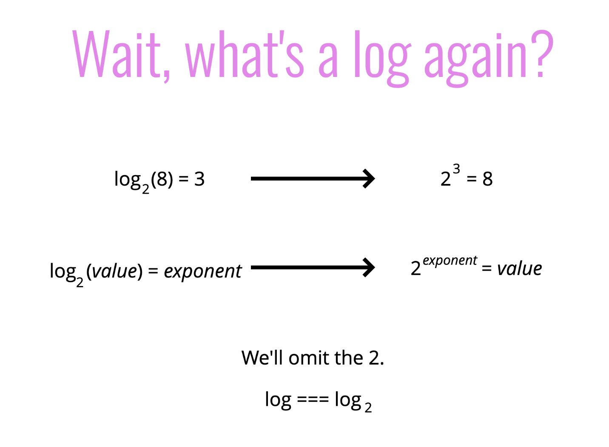

- a **logarithm** is the inverse of exponentiation
- Just like *division & multiplication* are a pair --> *logarithms & exponents exponentiation* are a pair
- Example in SLIDE: *log base two of eight equals three* --> what we are really calculating here is two to what power equals 8 --> 2 * 2 * 2 gives us 8 (3) --> 2^3 = 8
- most common are binary logarithm --> log two --> base ten --> log E 
- WE CARE ABOUT THE BIGGER PICTURE --> omit the 2
- This isn't actually a mathematical operation on its own, you can't just take the log of a number --> you need to have a base
* **RULE OF THUMB**: The logarithm of a number roughly measures the number of times you can divide that number by 2 *before you get a value that's less than or equal to 1*

#### **Logarithm Examples**
- 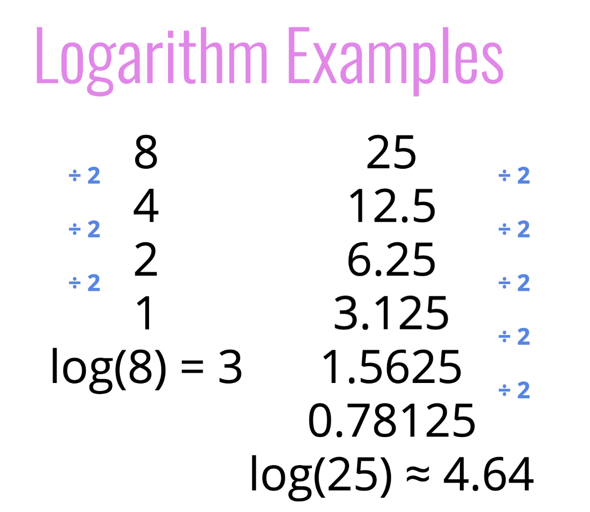

#### **Logarithm Complexity**
- 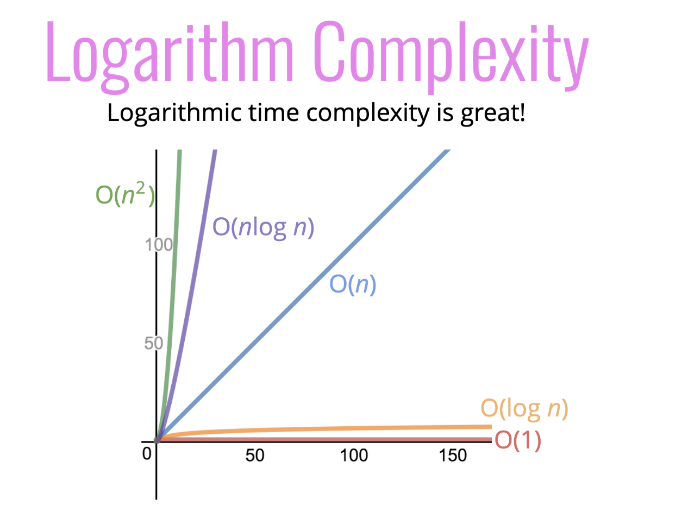
- O(log n) is better than O(n)

#### Where this comes in play
- Certain search algorithms have logarithmic time complexity
- Efficient sorting algorithms involve logarithms
- Recursion sometimes involves logarithmic space complexity
- and more...

## RECAP
- To analyze the performance of an algorithm, we use Big O Notation
- Big O Notation can give us a hig level understanding of the time or space complexity of an algorithm
- Big O Notation doesn't care about precision, only about general trends (linear? quadratic? constant?)
- The time or space complexity (as measured by Big O) depends only on the algorithm, not the hardware used to run the algorithm
- Big O Notation is everywhere, so get lots of practice!


