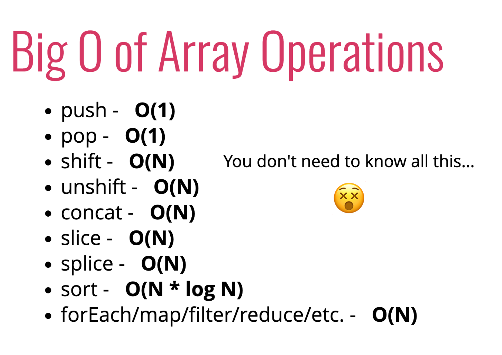

# Analyzing Performance of Arrays and Objects
#### **PREREQUISITES**
- Colt's Udemy Section 1: Big O Notation
* [SLIDES](https://cs.slides.com/colt_steele/built-in-data-structures-25)

## 1. Section Introduction
* **Built-In Data Structures** --> Through the lens of Big 0
- Analyze the things we do all the time in JS: working with Arrays, Objects, and built-in methods

#### **OBJECTIVES**
- Understand how objects and arrays work through the lens of Big O
- Explain why adding elements to the beginning of an array is costly
- Compare and Contrast the runtime for arrays and objects, as well as built in methods (forEach, sort, etc.)

## 2. The BIG O of Objects
* **Objects**: Unordered, key value pairs
```js
//OBJECT LITERAL
  let instructor = {
    firstName: "Kelly",
    isInstructor: true,
    favoriteNumbers: [1, 2, 3, 4]
  }
```
####  WHEN TO USE OBJECTS
- When you don't need order
- When you need fast access/insertion and removal
#### Big O of Objects 
1. **INSERTION** ==> 0(1)
2. **REMOVAL** ==> 0(1)
3. **SEARCHING** ==> 0(N)
4. **ACCESS** ==> 0(1)

- No beginning or end --> just add in using a key
- section on hash tables and hash maps where we look into what JS is doing behind the scenes
- SEARCHING --> Checking to see if a given piece of information is in a value somewhere (not searching for a key)

#### Big O of Object Methods
1. **Object.keys** ==> O(N)
1. **Object.values** ==> O(N)
1. **Object.entries** ==> O(N)
1. **hasOwnProperty** ==> O(1)
- If we are able to access information in constant time, we should also be ablet o check if a key exists in pretty much the exact same time --> `hasOwnProperty`

## 3. When Are Array's Slow?
* **ARRAYS**: Ordered Lists
```js
let names = ["Michael", "Melissa", "Andrea"];

let values = [true, {}, [], 2, "awesome"];
```
- There is an intrinsic ordering to the data
- Can come at a cost for some of the operations

* When to use Arrays
- When you need order
- When you need fast access/insertion and removal (sort of...)

- Other structures like singly linked list and a doubly linked list that still encode order (each element in particular spot and are connected)

#### Big O of Arrays
1. **INSERTION** ==> It depends...
2. **REMOVAL** ==> It depends...
3. **SEARCHING** ==> 0(N)
4. **ACCESS** ==> 0(1)
```js
let names = ["Michael", "Melissa", "Andrea"];
//              0           1          2
// Constant time to access any element in array
```
- If you have an index you can immediately jump to any element
- If you add a name to very `end` --> Constant Time --> `O(1)`
- If you add a name to the `beginning` of an array --> because of indices --> you have to re-index every element --> `O(N)` --> Same for removing from beginning of array 
- `PUSH` and `POP` always FASTER than `SHIFT` and `UNSHIFT`

#### Big O of Array Methods
* 
- push - O(1)
- pop - O(1)
- shift - O(N)
- unshift - O(N)
- concat - O(N) - merge two arrays together
- slice - O(N) - return copy of part of array as a new array
- splice - O(N) - remove and add new elements
- sort - O(N*logN)
- forEach/map/filter/reduce/etc. - O(N)

#### Limitations of Arrays
- Inserting at the beginning is not as easy as we might think! There are **more efficient** data structures for that

