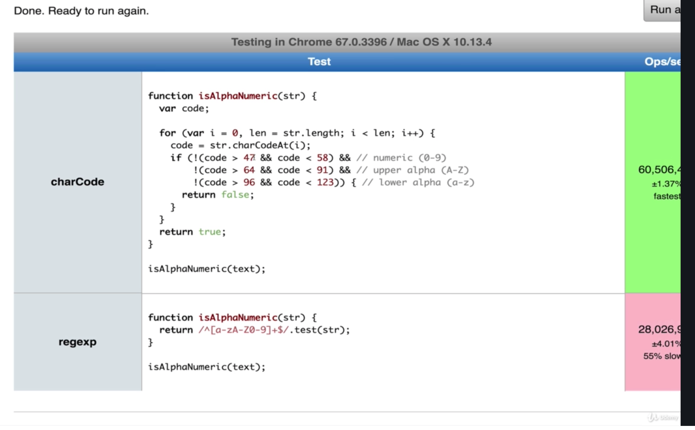

# Problem Solving Approach
**Prerequisites**
- Colt's Section 1: BIG O NOTATION 
* [SLIDES](https://cs.slides.com/colt_steele/problem-solving-patterns)

## Introduction to Problem Solving
- Algorithms and Problem Solving Patterns
#### Objectives
- Define what an algorithm is
- Devise a plan to solve algorithms
- Compare and Contrast problem solving patterns including frequency counters, two pointer problems and divide and conquer

#### What is An ALGORITHM
- A **process** or **set of steps** to accomplish a certain task
*Examples*
- A set of mathematical steps we need to solve a problem
- Facebook's algorithm that suggests certain ads to you
- Google's search algorithm --> 100 developers working together over 10+ years

#### Why do you need to know this?
- Almost everything you do in programming involves some kind of algorithm
- It's the foundation for being a successful problem solver and developer
- INTERVIEWS

#### How do You Improve?
1. **Devise** a plan for solving problems
2. **Master** common problem solving problems
#### Problem Solving Strategies
- Understand the Problem
- Explore Concrete Examples
- Break It Down
- Solve/Simplify
- Look Back and Refactor
- NOTE: many of these strategies are adapted from **George Polya**, whose book *How to Solve It* is a great resource for anyone who wants to become a better problem solver

## STEP 1: Understand the Problem
1. Can I restate the problem in my own words?
2. What are the inputs that go into the problem?
3. What are the outputs that should come from the solution to the problem?
4. Can the outputs be determined from the inputs? In other words, do I have enough information to solve the problem? (You may not be able answer this question until you set about solving the problem. that's okay; it's still worth considering the question at this early stage.)
5. how should I label the important pieces of data that are part of the problem?

#### Example
- Write a function which takes two numbers and returns their sum
```js
// ===============================================================
// Write a function which takes two numbers and returns their sum.
// ===============================================================

// 1. Can I restate the problem in my own words?
    // "implement addition"
// 2. What are the inputs that go into the problem?
    // "If we try to add really, really large numbers (string?), Is it only two inputs, what if someone wants to add four numbers, or leaves a number off"
    // -ints?
    // -floats?
    // -what about string for large numbers
// 3. What are the outputs that should come from the solution to the problem?
    // "should it be an integer, should it be a float, are floats allowed to be passed in, what about a string returning string if we are doing massive addition"
    // - int? float? string?
// 4. Can the outputs be determined from the inputs? In other words, do I have enough information to solve the problem? 
  //"what if someone only passes one number, do we add zero, do we return undefined or null or something"
  //"ask interviewer that"
// 5. how should I label the important pieces of data that are part of the problem?
  // "what matters"
  // function = add
  // numbers = num1 num2
  // sum
```
## STEP 2: Concrete Examples
- Explore Examples: Coming up with examples can help you understand the problem better
- Examples also provide sanity checks that you eventual solution works how it should
- USER STORIES
- UNIT TESTS 
#### STEPS TO TAKE
1. Start with Simple Examples
2. Progress to More Complex Examples
3. Explore Examples wit Empty Inputs
4. Explore Examples with Invalid Inputs

#### Example
- Write a function which takes in a string and returns counts of each character in the string.
- look at `practice.js` for brainstorming ideas

## STEP 3: Break It Down
- Explicitly write out the steps you need to take
- This forces you to think about the code you'll write before you write it, and helps you catch any lingering conceptual issues or misunderstandings before you dive in and have to worry about details (e.g. language syntax) as well.
- Helps to write out steps in comments in case you don't finish problem, at least interviewer can see you knew where it was going and what you might have needed to do
- sometimes it is all about SEEING YOUR PROCESS
```js
function charCount(str) {
  //make object to return at end
  //loop over string, for each character... 
    //if the char is number/letter AND is a key in object, add one to count
    //if the char is number/letter AND is a key in object, add one to count
    // if char is something else (space, period, etc.) don't do anything
  //return object at end
}
```

## STEP 4: Solve Or Simplify
- Solve the Problem --> if you can't --> Solve a Simpler Problem
- try to ignore the part that is giving you a really hard time in order to focus on everything else
- sometimes things can click into place when focus on simpler parts --> make sure to do first 3 steps
#### SIMPLIFY
1. Find the core difficulty in what you are trying to do
2. Temporarily ignore that difficulty
3. Write simplified solution
4. Then incorporate that difficulty back in


## STEP 5: Look Back and Refactor
1. Can you check the result?
2. Can you derive teh result differently?
3. Can you understand it at a glance?
4. Can you use the result or method for some other problem?
5. Can you improve the performance of your solution?
6. Can you think of other ways to refactor?
7. How have other people solved this problem?

* EXAMPLE OF USER TESTING charCodeAt


## RECAP AND INTERVIEW STRATEGIES
* **Devise** a plan for solving problems
1. Understand the Problem
2. Explore Concrete Examples
3. Break It Down
4. Solve/Simplify
5. Look Back and Refactor

